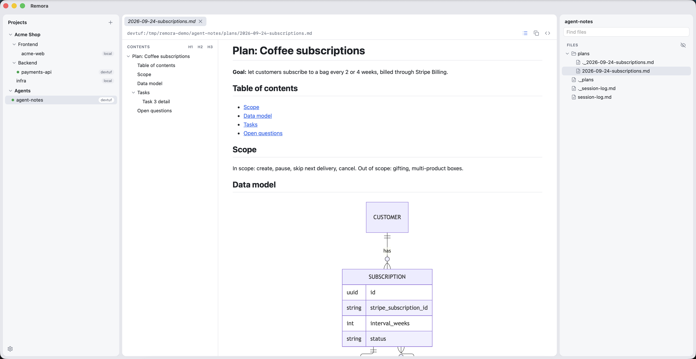

# Remora

A small desktop viewer for projects on remote dev boxes and on this Mac. It shows projects in a sidebar, renders markdown (GFM, mermaid, TOC), highlights code, and reloads automatically when an agent writes a file. You can drop files from Finder onto the file tree to upload them into a project, and right-click a file or folder to download it; nothing on the host is ever overwritten.



## Requirements

- macOS, Rust ≥ 1.80, Node ≥ 20, pnpm.
- Each host is an alias in `~/.ssh/config` that logs in with a key or ssh-agent. Remora uses `BatchMode=yes` and never asks for a password.
- To view a folder on this Mac, use the host `local` (so an ssh alias named `local` cannot be used). Local projects are read directly and watched with FSEvents.
- The remote is Linux with GNU coreutils/findutils.
- Install `inotify-tools` on each remote (strongly recommended):

  ```sh
  sudo apt install inotify-tools   # Debian/Ubuntu
  sudo dnf install inotify-tools   # Fedora/RHEL
  ```

  With `inotifywait` available, changes are pushed over a single ssh session as they happen. Without it, Remora falls back to running `find` over the whole project every 2 s, which is slower to notice changes and keeps loading the server on large repos. For big trees, raise the watch limit if needed: `sudo sysctl fs.inotify.max_user_watches=524288`. Remora checks for `inotifywait` whenever the watcher (re)connects; to switch an already-open project to inotify, pick another project and come back.

## Develop

Toolchain versions (Node, pnpm, Rust) are pinned in `mise.toml`. With [mise](https://mise.jdx.dev): `mise install`, then `mise run dev | test | test:remote | build`. Without mise:

```bash
pnpm install
pnpm tauri dev          # run the app
pnpm test               # frontend unit tests
cd src-tauri && cargo test                                   # Rust unit tests
REMORA_TEST_HOST=devbox cargo test --test remote -- --test-threads=1   # against a real host
pnpm tauri build        # produce Remora.app
```

## Upload / Download

- **Upload**: drag files or folders from Finder onto the file tree. Dropping on a folder uploads into it, on a file into that file's folder, on empty space into the project root. A name that already exists gets a Finder-style suffix (`report (1).md`); nothing is overwritten.
- **Download**: right-click a file or folder → **Download**. It is saved in `~/Downloads` (renamed the same way if needed); the toast's **Show in Finder** reveals it.
- Remote transfers stream `tar` over the same ssh connection, so the host needs `tar` (standard on Linux). Folders are copied as they are, including `node_modules` or `.git` if you drop them.

## Shortcuts

| Keys | Action |
|---|---|
| ⌘P | Go to file |
| ⌘W | Close tab |
| ⌘⇧[ / ⌘⇧] | Previous / next tab |
| ⌘1…9 | Switch project |
| ⌘R | Reload current file |
| ⌘F | Find in the open file (Enter / ⇧Enter next / previous, Esc closes) |
| ⌘G / ⌘⇧G | Next / previous match |
| ⌘B / ⌘⌥B | Toggle left / right panel |
| ⌘, | Settings (theme, fonts, font size) |

Config lives in `~/Library/Application Support/remora/config.json`, including the `settings` block (theme, fonts, font size) edited from ⌘,. Design decisions are recorded in `docs/adr/`.
